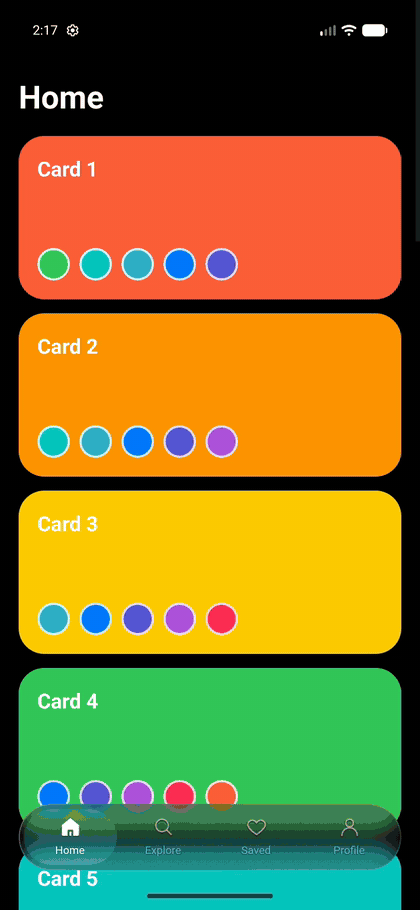

# react-native-liquid-tabs

The iOS 26 Liquid Glass tab bar, on Android.

<p align="center">
  
</p>

- A glass **droplet lens** that lifts off the bar when you press it, follows your finger as you drag, magnifies and bends the icons under it, and lands on the tab you let go of.
- A **real blur** of your screen behind the bar, cropped to the bar and drawn at a quarter of the size on the GPU, so it stays smooth.
- **120 Hz while it moves** on adaptive-refresh screens, and nothing running while it's idle.
- **The system tab bar on iOS**, so iOS keeps the real Liquid Glass. One API for both platforms.

Physics and look were tuned frame by frame against iOS 26 screen recordings (lift, drag lag, squash at speed, the soft bulge after a stop, the landing).

## Requirements

- Expo SDK 54+ (tested on SDK 57), or a bare React Native app with `expo-modules-core`; New Architecture; a **development build** (not Expo Go)
- `react-native-reanimated` 4, `react-native-worklets`, `react-native-gesture-handler`, `react-native-safe-area-context`
- Skia: either `@shopify/react-native-skia` (v2) or `react-native-skia` (v3)
- Blur needs Android 12+ (API 31). Older Android versions get the same bar on a tinted, unblurred glass.

## Install

```sh
npx expo install react-native-liquid-tabs react-native-reanimated react-native-worklets react-native-gesture-handler react-native-safe-area-context @shopify/react-native-skia
```

Then rebuild your dev client (`npx expo run:android`). The package has a small Android native module (the blur and the 120 Hz request); iOS needs no native code from it.

## Expo Router

Make it your tabs layout, e.g. `app/(tabs)/_layout.tsx`:

```tsx
import { LiquidTabs } from "react-native-liquid-tabs/expo-router";
import { TabIcons } from "react-native-liquid-tabs";

export default function TabsLayout() {
  return (
    <LiquidTabs
      tabs={[
        { name: "index", href: "/", title: "Home", icon: TabIcons.home, sfSymbol: { default: "house", selected: "house.fill" } },
        { name: "search", href: "/search", title: "Search", icon: TabIcons.search, sfSymbol: "magnifyingglass" },
        { name: "profile", href: "/profile", title: "Profile", icon: TabIcons.person, sfSymbol: { default: "person", selected: "person.fill" } },
      ]}
    />
  );
}
```

On iOS this renders Expo Router's `NativeTabs` (Liquid Glass on iOS 26). On Android it renders headless tabs inside a blur target, with the glass bar floating over them.

| Prop | Type | |
|---|---|---|
| `tabs` | `{ name, href, title, icon, sfSymbol? }[]` | `name` is the route file, `icon` is the Android icon, `sfSymbol` the iOS one |
| `dark` | `boolean` | Defaults to the system colour scheme |
| `activeColor` / `inactiveColor` | `string` | Icon and label colours (also the iOS tint) |
| `backgroundColor` | `string` | Your screen background; the lens shows it where it looks past the bar's edge |
| `labelFont` | `require()`d font | Label font (system font by default) |
| `hideOnKeyboard` | `boolean` | Slide the Android bar away while the keyboard is open (default `true`) |
| `minimizeBehavior` | `"onScrollDown"` … | iOS 26 tab bar minimising |

## React Navigation

Spread `liquidTabBar()` onto a bottom-tab navigator:

```tsx
import { createBottomTabNavigator } from "@react-navigation/bottom-tabs";
import { TabIcons } from "react-native-liquid-tabs";
import { liquidTabBar } from "react-native-liquid-tabs/react-navigation";

const Tab = createBottomTabNavigator();

<Tab.Navigator {...liquidTabBar({ icons: { Feed: TabIcons.home, Messages: TabIcons.chat } })}>
  <Tab.Screen name="Feed" component={Feed} />
  <Tab.Screen name="Messages" component={Messages} />
</Tab.Navigator>;
```

It takes the same colour and font options as `LiquidTabs`, plus `icons` (by route name). Labels come from each screen's `tabBarLabel` or `title`, and presses emit `tabPress` as usual. It changes nothing on iOS: pair it with a native tabs navigator there (for example `react-native-bottom-tabs`) for Liquid Glass.

## Your own layout

Use the pieces directly when you manage the tabs yourself:

```tsx
import { useRef, useState } from "react";
import { View } from "react-native";
import { BlurTarget, FloatingTabBar, TabIcons } from "react-native-liquid-tabs";

function Screen() {
  const blurTarget = useRef<View>(null);
  const [index, setIndex] = useState(0);
  return (
    <View style={{ flex: 1 }}>
      <BlurTarget ref={blurTarget} style={{ flex: 1 }}>
        {/* the content the bar floats over */}
      </BlurTarget>
      <FloatingTabBar
        blurTarget={blurTarget}
        activeIndex={index}
        onChange={setIndex}
        items={[
          { key: "home", label: "Home", icon: TabIcons.home },
          { key: "saved", label: "Saved", icon: TabIcons.heart },
        ]}
      />
    </View>
  );
}
```

The bar must sit **outside** the `BlurTarget` it blurs: a view can't blur a picture of itself. `FloatingTabBar` positions the bar above the safe area; `GlassTabBar` is the bare bar if you want to place it yourself.

## Icons

Icons are SVG path data on a 24×24 grid, so Skia can draw and refract them:

```ts
const bolt: TabIcon = {
  stroke: "M13 2L4 14h7l-1 8 9-12h-7z", // outline, drawn when not selected
  solid: "M13 2L4 14h7l-1 8 9-12h-7z", // filled when selected (optional; otherwise a bolder outline)
  cutout: "...", // lines punched out of `solid` (optional)
  dot: "...", // small filled detail in both states (optional)
};
```

Built in: `TabIcons.home`, `search`, `compass`, `shield`, `wallet`, `sparkle`, `users`, `person`, `heart`, `bell`, `chat`, `calendar`. Paths from most outline icon sets (Lucide, Tabler, Heroicons, which also use a 24 grid) work as `stroke`.

## Screen insets

The Android bar floats over your content, so leave room for it at the bottom of scroll views:

```tsx
import { useTabBarInset } from "react-native-liquid-tabs";

const bottom = useTabBarInset(); // safe area + bar on Android, safe area on iOS
<ScrollView contentContainerStyle={{ paddingBottom: bottom }} />;
```

Also exported: `useFloatingBarBottom()` (for chrome that floats just above the bar), `useTabBarHeight()`, `useKeyboardVisible()` and `setHighFrameRate(on)`.

## How it works

- **Blur:** `BlurTarget` records its children into a `RenderNode` each frame. The glass view re-records only the part of that node behind the bar (plus the blur's reach) at 1/4 size, blurs it with a `RenderEffect`, scales it back up and adds a faint noise texture. Blurring the whole screen at full size every frame, as general-purpose blur views do, kept a moving bar from reaching 120 Hz; on a test phone, this crop took drag frames from ~11 ms to ~8 ms and janky frames from 48% to 4%.
- **Lens:** the icon rows are rendered once into two images (plain and selected). Each frame, one Skia runtime shader composites and refracts them inside the droplet: even magnification in the middle, outward-looking flat edges, round lensing at the ends, and colour fringing that grows with speed.
- **Motion:** the drop follows its goal through an underdamped spring integrated in fixed 4 ms steps, so it behaves the same at 60 Hz, 120 Hz and through dropped frames. Everything runs on the UI thread; React renders only when the tab changes. The frame callback stops itself once the drop is at rest.

## Limitations

- Android 12+ for the blur (tinted glass below that).
- Web isn't supported.
- Metro must allow optional dependencies (Expo's default config does) so only your installed Skia package is bundled.
- `labelFont` is read once, when the bar first mounts.

## Examples

- `example/`: Expo Router (`pnpm install && npx expo run:android`)
- `example-react-navigation/`: React Navigation bottom tabs

## Credits

The noise texture and the RenderNode blur approach come from [BlurView](https://github.com/Dimezis/BlurView) by Dmitry Saviuk (Apache 2.0); see `NOTICE`.

## License

MIT
